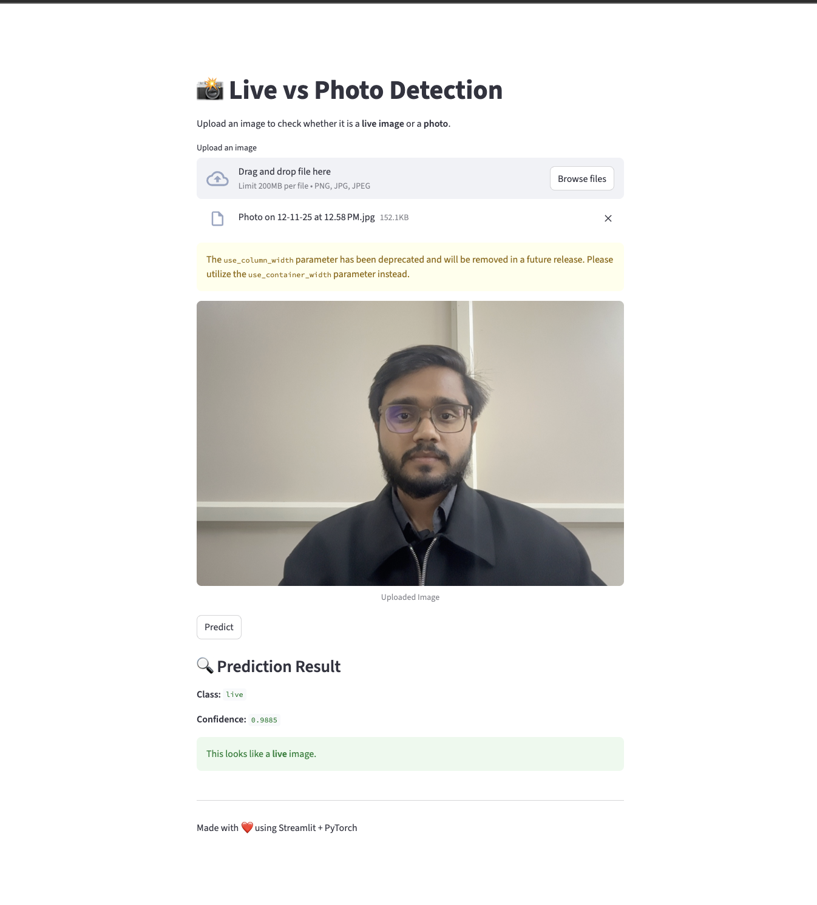

# Live Image Detector – ResNet18

### A Streamlit-based application that predicts whether an uploaded image is a Live (Real) selfie or a Photo (Spoof) using a fine-tuned ResNet18 model.
#### link[https://resnet18livephotodetector-c3pisrnqsb7dpdykm2pglj.streamlit.app/]
### This model is trained on an Indian face dataset and achieves 95.87% accuracy on 4 private test datasets.

### Model Information

- Base architecture: ResNet18
- Framework: PyTorch
- Custom trained on Indian face dataset
- Accuracy: 95.873%
- Output classes:
    - 0 → Live
    - 1 → Photo

## Run app locally 

git clone https://github.com/chandraprakashpatra/Resnet18_LivePhotoDetector.git
cd Resnet18_LivePhotoDetector

streamlit run app.py

